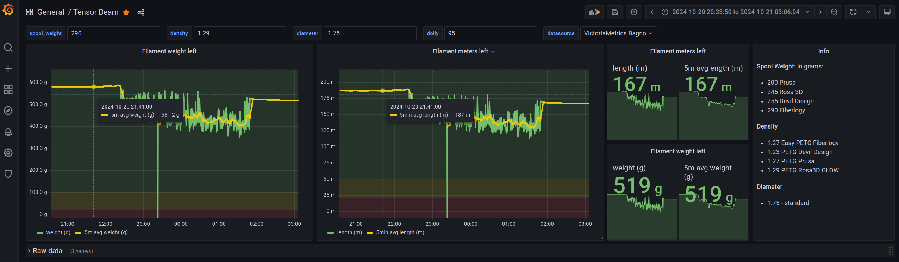
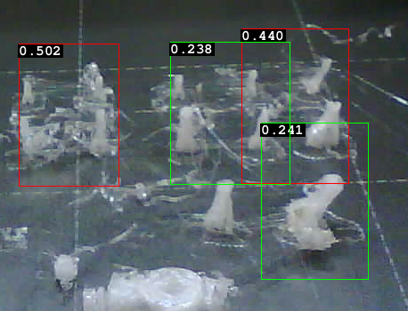

# 3d-print

Various things related to 3D printing.

Use at your own risk.

## List of things per directory

- [filament usage](filament-usage/README.md)
  grafana dashboard about filament usage by using esp32 + load cell

  

- [Linux thumbnails](linux-thumbnails/README.md)
  generate thumbnails for file managers such as Thunar (XFCE4)

  

- [Node-Red PrusaLink status to Slack](node-red-prusa-link-to-slack/README.md)
  use Node Red to check printer status via Prusa Link and send status change
  to Slack via webhook

- [obico-ml-api-only](obico-ml-api-only/README.md)
  run Obico ML API without anything, so you can use it with other projects.
  Also script to draw detections on images.

  

- [picamera-web](picamera-web/README.md)
  python picamera2 exposed via web (gunicorn)

  `rpi csi  camera <-- python --> gunicorn --> web clients`

  allows to access Raspberry Pi CSI cameras as snapshots via web url
  nicely integrates with [obico-ml-api-only](./obico-ml-api-only/README.md)

- [prusa-connect-proxy](prusa-connect-proxy/README.md)
  run Prusa printer through HTTP proxy and capture whatever it does!

  `printer <-- http --> proxy <-- https --> connect.prusa3d.com`

- [prusa-link-no-password](prusa-link-no-password/README.md)
  access Prusa printer through HTTP proxy so you don't have to type in password

  `your laptop <-- http --> proxy injecting auth <-- http --> printer`

- [prusa3d-help-pdf-generator](prusa3d-help-pdf-generator/README.md)
  generate PDF files from Prusa3d help articles, for example for offline read
  <!-- markdownlint-disable html line-length -->
   +  =
  
  <!-- markdownlint-enable html line-length -->

- [prusa3d-metrics-list](prusa3d-metrics-list/README.md)
  get metrics that can be send from PrusaFirmwareBuddy devices to syslog server

- [stl-to-png](stl-to-png/README.md)
  Use PrusaSlicer to generate images per slice, useful for woodworks.

  
