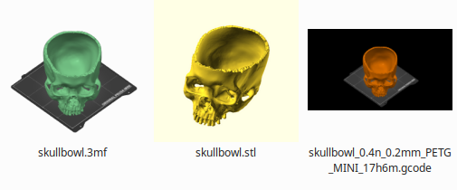

# 3d-print

Various things related to 3D printing.

Use at your own risk.

## List of things per directory

- [Linux thumbnails](linux-thumbnails/README.md)
  generate thumbnails for file managers such as Thunar (XFCE4)

  

- [prusa3d-help-pdf-generator](prusa3d-help-pdf-generator/README.md)
  generate PDF files from Prusa3d help articles, for example for offline read
  <!-- markdownlint-disable html line-length -->
   +  =
  
  <!-- markdownlint-enable html line-length -->

- [prusa3d-metrics-list](prusa3d-metrics-list/README.md)
  get metrics that can be send from PrusaFirmwareBuddy devices to syslog server

- [stl-to-png](stl-to-png/README.md)
  Use PrusaSlicer to generate images per slice, useful for woodworks.

  
