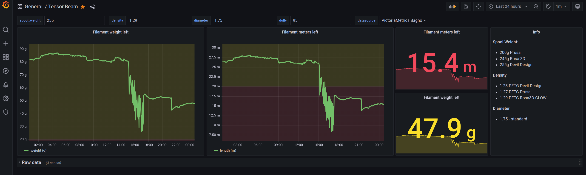

# Filament usage

## About



This repo is about generic filament usage by the printer:

- read current filament weight via tensor beam attached to esp32
- register esp32 in Home Assistant
- Home Assistant exposes metrics in Prometheus format
- metrics are scraped (fetched) bu Prometheus instance
- Grafana uses Prometheus as data source
- Grafana dashboard uses some basic formulas to convert weight to meters
  of filament to be used

## Bill of Materials

- esp32 devive such as [nodemcu dev kit](https://www.espressif.com/en/products/devkits/esp32-devkitc/overview)
- [tensor beam](https://www.sparkfun.com/products/13879)
  (load cell) with hx711 sensor in range up to 5kg
  (max weight is important)
- (ptional) tensor beam logic converter (usuallly provided with load cell)
- some wooden planks + screws + washers
- at least 4 dupont cables
- at least 2 example weights with precise values (to calibrate the tensor beam),
  such as 0.5kg and 1kg

## Hardware assembly

- ensure that your tensor beam can sustain given load such as 1 spool of the filament,
  which usually means it is under 2 or 5 kg
- create a 'weight setup', which means one plank attached to the bottom of the
  load cell, and the other plank is attached to the top of the load cell, all
  using generic nuts/bolts/washers

- attach dupont cables to the esp32 - see [here](https://randomnerdtutorials.com/esp32-load-cell-hx711/)

## Software

- install esphome on the device
- extend device config with [hx711 params](https://esphome.io/components/sensor/hx711.html),
  below code fragment assumes that `GPIO18` and `GPIO19` are used to connect the device to esp32:

  ```yaml

  sensor:
    - platform: hx711
      name: "${device_name} HX711 Value"
      dout_pin: GPIO19
      clk_pin: GPIO18
      gain: 128
      update_interval: 10s
  ```

- [flash esphome firmware](https://web.esphome.io/), add the code above to the device,
  see if the tensor beam reacts to the changes
- ensure tensor beam is not under load - write down the current value
- place example known weight on the tensor beam, write down the raw value, remove the weight,
  this will come in handy later on

- attach to Home Assistant (default) or expose Prometheus metrics directly on the device
- configure Prometheus to scrape the metrics
  (in case of Home Assistant you may need to add basic auth)
- use Grafana and connect it to Prometheus as data source,
  ensure you can find hx711 metrics in the grafana
- add [dashboard](./grafana-dashboard.json) to the Grafana, adjust it to meet your needs such as
  spool size, filament diameter and density
