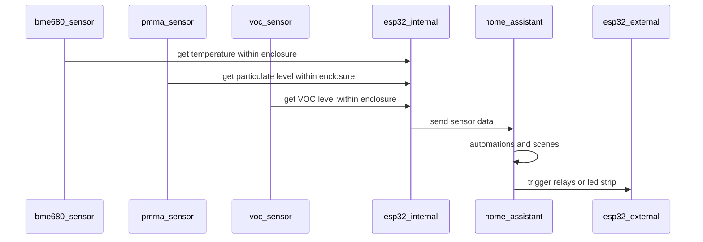
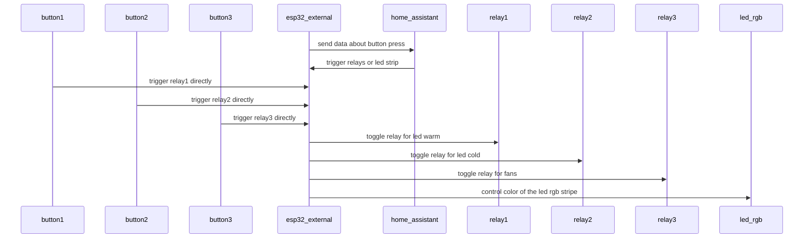
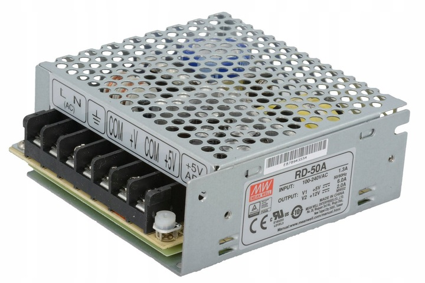
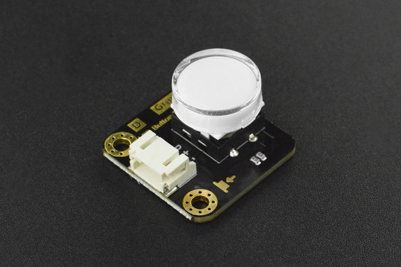
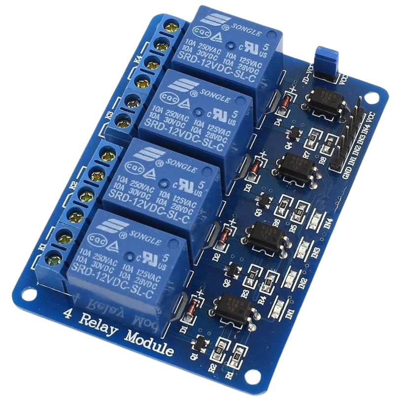

# HomeAssistant and Prusa Mini integration

# About

I have a Prusa Mini+ in the Prusa Enclosure, and decided to do some extra automation around it.

Two ESP32 devices (could be done with a single one, but I'm lazy):

- external - for reading buttons and controlling lights, fans
- internal - just for gathering data about the climate within the enclosure

HomeAssistant scenes and automations to trigger scenes depending on what is happening.

- turn on cold lights on/off
  if printing or print finished
- turn on red color on LED strip
  if the nozzle is over 70C
- turn on blue color on LED strip
  if the nozzle is below 65C
- turn on green color on LED strip
  if the print is finished,
  the enclosure temperature is below 30C,
  the printed material is ABS/ASA/PETG
- turn on purple color on LED strip
  if the particulate level is above 5000 units/liter

See more details about the scenes at the end of this document.

# Diagrams

Exact GPIO connections are in esphome configs, see [esphome section](#esphome).

# Bill of Materials

- dedicated Power Supply Unit, such as Mean Well RD-50A (50W, 5V, 12V), can have lower wattage

- buttons - 3x DFRobot [SKU:DFR0785](https://wiki.dfrobot.com/_SKU_DFR0785_LED_Button)

- relays - 1x 5V 4-Channel Relay Board Module (optionally 3.3V, depends on your base voltage)

- LED main lights - whatever you like, 12V recommended, the best if they are a
  a strip that can be cut, 60 leds/meter is recommended

- LED color strip - some trash controllable via PWM per channel via inverted signal
  (meaning the 100% PWM makes things to go dark) - optionally just get a single
  3 color led in one package, or three different color leds, another option
  would be to use addressable led but this is not covered in here

- fans - whatever at 12V, can be a PC computer fans, I used 5015 from
  [Nevermore Micro](https://github.com/nevermore3d/Nevermore_Micro) project

- temperature/humidity - [BME680](https://esphome.io/components/sensor/bme680/)
  which can also work instead of particulate/VOC sensor in certain situations

- particulate - [PMSX003](https://esphome.io/components/sensor/pmsx003/) is a
  group of sensors used to detect larger particles

- VOC (volatile organic compounds) - various models exist, such as
  [ens160](https://esphome.io/components/sensor/ens160/)
  or
  [sgp40/sgp41](https://esphome.io/components/sensor/sgp4x/)

- esp32 devices on the board, helps with connecting cables
- maybe some groove connectors to attach senssors
- lots of female-female DuPont jumper wires
- cables for LED strips
- cable connectors - for example WAGO
- soldering iron/soldering skills recommended

# Inputs

- esp-external - buttons - 3x binary sensor - to trigger lights/fans, 3 pins
- exp-internal - particulate, VOC, temperature, reading over i2c, so 2 pins only

## Buttons

Buttons outside of the enclosure are used to trigger other actions, such as

- turn on/off warm/cold lights
- turn on/off fans

3x GPIO as input - binary

Generally you can use any button you like.

## Sensors

Generic sensors about VOC, articulate and temperature, they use I2C so you just
need a splitter to connect each device, but on ESP32 it takes only two GPIO pins.

# Outputs

## LED lights

I added custom LED lights inside of the enclosure - yellow (warm) and white (death).

Warm lights are for normal servicing and operation, something about 2400K.

White lights - I call them death lights because they are something about 6000K
and it's hard to look at them directly but are great at improving the quality
of the camera shots from the within the enclosure.

Each LED light is controlled with a separate relay - 2x GPIO pins as output.

## LED color strip

Some dumb LED color strip that is controllable by three GPIO output pins - each
pin controls the color on the whole length of the led strip.

3x GPIO pins as output

## Fans

Fans are needed for filtering the air inside of the enclosure, using nevermore micro project.

Both fans are controlled with a single relay, there is no speed control, because
trying to use it with the given fans it ended in some totally bizarre readings of
the speeds of the fans.

Each fan reports its own speed via pulses to a separate GPIO pin to esp32

1x GPIO pin as output to relay.
2x GPIO pin as input to count pulses per fan.

# ESPHome

- see example
  [esphome-external.yaml](./esphome/esphome-external.yaml)
  and
  [esphome-internal.yaml](./esphome/esphome-internal.yaml) configs
- look carefully at the GPIO assignments etc
- I used ESPHome 2025.11.5 which used esp-idf framework for the configs,
  but with some minor changes you can adjust it to older firmware, there is nothing
  special in the configs.

# HomeAssistant

- add esphome devices to HomeAssistant
- add [PrusaLink](https://www.home-assistant.io/integrations/prusalink/) to HA per printer
- add scenes for LED color strip depending on the nozzle temp/ VOC/particulate or other things
- add scenes for LED lights depending on what happened with the printer
- add triggers to trigger specific scenes based on the nozzle temperature or sensor values

I'm providing raw yaml files, which should guide you how to do it with your devices,
unfortunately this is not easy to map directly.

## Scenes

- [chamber-cold](./scenes/chamber-cold.yaml) - set LED strip color to green,
  mainly to prevent warping items if printer with ABS/ASA
- [chamber-hazard](./scenes/chamber-hazard.yaml) - set LED strip color to purple -  you breath it, you die
- [nozzle-cold](./scenes/nozzle-cold.yaml) - set LED strip color to blue - safe for maintenance
- [nozzle-hot](./scenes/nozzle-hot.yaml) - set LED strip color to red - to avoid getting burned by the nozzle

## Automations

## Generic lights

- [turn on cold lights if the printer prints](./automations/trigger-lights-cold-on.yaml) -
  if the printer is printing,
  and bed temperature above 30C,
  and nozzle temperature above 50C
  then
  turn on relay 2

- [turn off cold lights after the print](./automations/trigger-lights-cold-off.yaml) -
  if the nozzle temperature is below 50C,
  and printer state is finished or idle of 5minutes (may need to make it shorter)
  then
  turn off relay 2

### Color LED strip

- [trigger scene chamber cold](./automations/trigger-chamber-cold.yaml) -
  if the nozzle temperature is below 30C,
  and printer state is finished or idle,
  and print material is ABS/ASA/PETG
  then
  trigger scene chamber cold (green)

- [trigger scene chamber hazard](./automations/trigger-chamber-hazard.yaml) -
  if the particulate sensor is above 5000
  then
  trigger scene chamber hazard (purple)

- [trigger scene nozzle cold](./automations/trigger-nozzle-cold.yaml) -
  if the nozzle temperature below 65C
  then
  trigger scene nozzle cold (blue)

- [trigger scene nozzle hot](./automations/trigger-nozzle-hot.yaml) -
  if the particulate sensor is above 5000
  then
  trigger scene nozzle hot (red)
