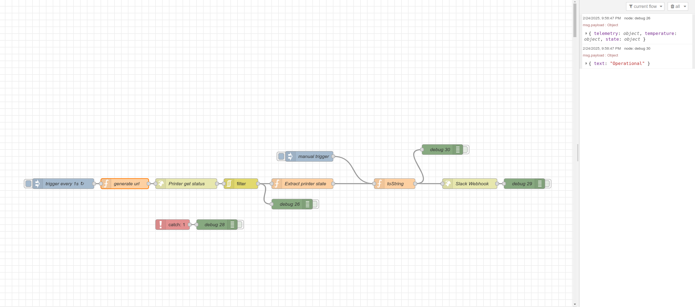

# Node-Red send to Slack status from Prusa printer

tldr:

- install [node-red](https://flows.nodered.org/)
- go to Slack, add basic app with a webhook
- test if the webhook works with curl tool
- import [this flow](./node-red-prusa-link-to-slack.json) to node-red
- edit `generate url`, and replace the values in the top with the url to the
  printer and token (you can find token in the printer LCD menu)
- edit `Slack Webhook` in it - replace URL to the one you tested with curl
- click Deploy in node-red (top right corner)
- check Slack channel for messages
- adjust `Extract Printer State` or `toString` nodes to your needs and deploy.

