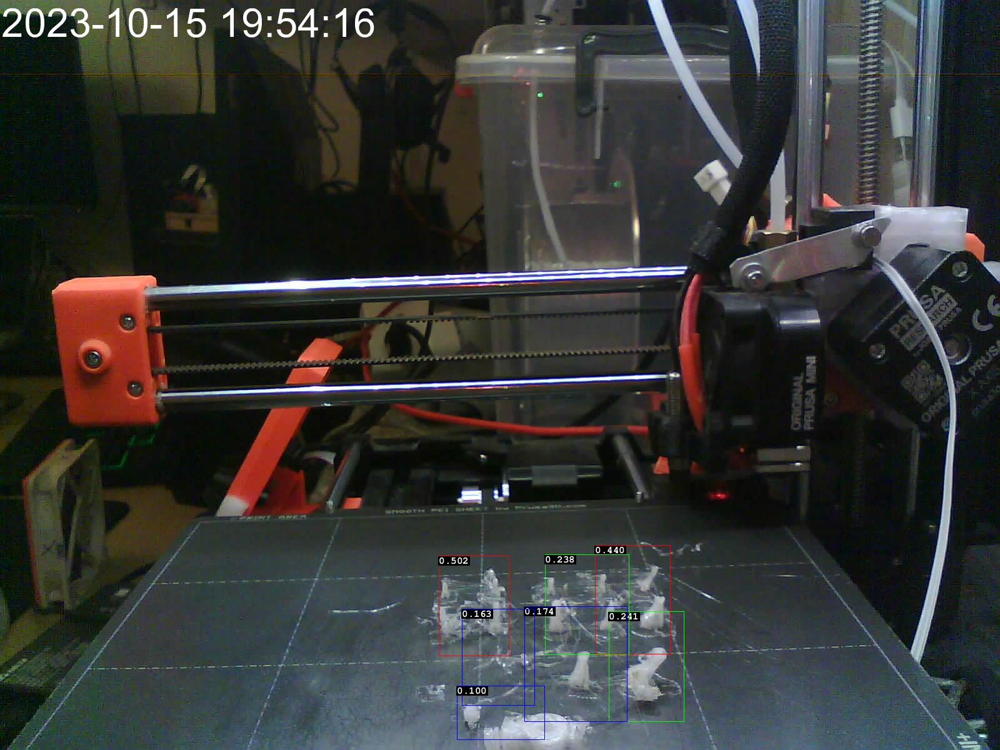

# obico-ml-api-only

Spawn [Obico ML API](https://www.obico.io/docs/server-guides/) container without any authentication
or any other Obico apps. This is for people that REALLY just want to have an API
for image detections, which can be further scripted with other tools.

## Features

Container image is from my modified app version:

- extra debug messages
- send more details to statsd
- allow passing ignored zones to avoid false positives due to the areas in the
  camera that contains problematic items (especially timestamps or some cables)
- draw_detections.py as CLI script to render detections on the image directly
- server.py to make it a web app

The AI model is left as is. You can find git sha which was used for builds in
[this repo](https://github.com/nvtkaszpir/obico-server/), the built images
are pushed to [quay.io](https://quay.io/repository/kaszpir/ml_api?tab=tags)
based on `<git-short-sha>-<arch>`. I mainly push to `dockerfile-cleanups` branch
in there.

## CLI Usage

Just feed it with a param to fetch image to process if it is able to detect
spaghetti. Output from the API is in JSON.

```shell
docker-compose up
```

Notice that container image size is about 3GB.
Docker compose up will spawn container which listens on port `3333`.

In general Obico ML API needs to get `img` param which tells it to fetch image from
given URL to be processed. So you need a HTTP server to host the image, which
will be consumed by python app that runs within the Obico ML API container.

The target url can be also a real working camera if it is able to return image per se -
for example [esphome web server](https://esphome.io/components/esp32_camera_web_server.html)
with `snapshot` mode will work.

### Install dependencies

To run additional script `draw_detections.py` you may need some local dependencies:

```shell
pip install -r requirements.txt

```

## Draw basic detections to file

You can run parameters such as `--saveimg` and `--savedet` to save output to files without preview, for easier scripting:

<!-- markdownlint-disable html line-length -->
```shell
python3 draw_detections.py --api http://127.0.0.1:3333 https://bagno.hlds.pl/obico/bad_1.jpg --savedet out.json --saveimg out.jpg
```
<!-- markdownlint-enable html line-length -->

This should export detections to json and image file, each one can be further passed by other tools.


[out.json](./out.json)
<!-- markdownlint-disable html line-length -->
```json
[["failure", 0.502, [758.0, 969.0, 113.0, 160.0]], ["failure", 0.44, [1012.0, 959.0, 121.0, 174.0]], ["failure", 0.241, [1034.0, 1066.0, 120.0, 176.0]], ["failure", 0.238, [939.0, 967.0, 134.0, 161.0]], ["failure", 0.174, [921.0, 1062.0, 164.0, 184.0]], ["failure", 0.163, [797.0, 1051.0, 117.0, 154.0]], ["failure", 0.1, [801.0, 1140.0, 140.0, 86.0]]]
```

<!-- markdownlint-enable html line-length -->

(No the printer is not skewed, this is the effect of camera lens distortion because it is not perpendicular to the bed)

Backward compatible behaviour.

## Draw detections with preview

Just add `--show` parameter, good for interactive debugging.

For pure example purposes replace `https://bagno.hlds.pl/obico/bad_1.jpg` with the url to the image from the camera.
The URL must point to the address that is resolvable and reachable by the processes within the container.

<!-- markdownlint-disable html line-length -->

```shell
python3 draw_detections.py --api http://127.0.0.1:3333 https://bagno.hlds.pl/obico/bad_1.jpg --show

INFO:root:api=http://127.0.0.1:3333
INFO:root:show=True
INFO:root:url=https://bagno.hlds.pl/obico/bad_1.jpg
DEBUG:urllib3.connectionpool:Starting new HTTPS connection (1): bagno.hlds.pl:443
DEBUG:urllib3.connectionpool:https://bagno.hlds.pl:443 "GET /obico/bad_1.jpg HTTP/1.1" 200 999433
DEBUG:urllib3.connectionpool:Starting new HTTP connection (1): 127.0.0.1:3333
DEBUG:urllib3.connectionpool:http://127.0.0.1:3333 "GET /p/?img=https%3A%2F%2Fbagno.hlds.pl%2Fobico%2Fbad_1.jpg HTTP/1.1" 200 853
[["failure", 0.502, [758.0, 969.0, 113.0, 160.0]], ["failure", 0.44, [1012.0, 959.0, 121.0, 174.0]], ["failure", 0.241, [1034.0, 1066.0, 120.0, 176.0]], ["failure", 0.238, [939.0, 967.0, 134.0, 161.0]], ["failure", 0.174, [921.0, 1062.0, 164.0, 184.0]], ["failure", 0.163, [797.0, 1051.0, 117.0, 154.0]], ["failure", 0.1, [801.0, 1140.0, 140.0, 86.0]]]

```
<!-- markdownlint-enable html line-length -->

## Usee Below Treshold

With additional options `--show-below-treshold`:
<!-- markdownlint-disable html line-length -->
```shell
python3 draw_detections.py --api http://127.0.0.1:3333 https://bagno.hlds.pl/obico/bad_1.jpg --savedet out-below.json --saveimg out-below.jpg --show-below-treshold
```
<!-- markdownlint-enable html line-length -->

you should see blue areas that are below treshold:

- [out-below.json](./out-below.json)
- 

With option `--treshold=0.4`:
<!-- markdownlint-disable html line-length -->
```shell
python3 draw_detections.py --api http://127.0.0.1:3333 https://bagno.hlds.pl/obico/bad_1.jpg --savedet out-t04.json --saveimg out-t04.jpg --treshold=0.4
```
<!-- markdownlint-enable html line-length -->

You will see only specific areas:

- [out-t04.json](./out-t04.json)
- 

## Pass on ignored regions

This one allows you to stop being irritated by the fact that something enters camera view
and is triggering failure detection - such as:

- timestamps on camera
- moving objects such as cables
- hard to mask elements such as strong casted shadows + reflections from windows from passing cars

That's why `--ignore` param can be used.

Add `--ignore="[json_table]"` to ignore certain regions.

Imagine you have source image 800x600, then we want to exclude left half of
the image. In normal coords this is (x=0,y=0 top left image corner)
x=0, y=0, w=400, h=300
but in the 'detections' format it needs to be encoded as `center of the box x`,
`center of the box y`, `box width`, `box height`, so our coords are:
(half, half, width, height)
xc=200, y=150, w=400, h=300

and for bound box with corners top_left=10,20, bottom_right=30,40
it would be:
xc=(30-10)/2
yc=(40-20)/2
w=30-10
h=40-20

Let say I have such regions to ignore:

```json
[
  [320, 32, 640, 64], // top left corner with timestamp
  [210, 600, 420, 1200], // left area with cables
  [1500, 600, 200, 1200] // right are with cables
]
```

The parameter passed is

`[[320, 32, 640, 64],[210, 600, 420, 1200],[1500, 600, 200, 1200]]`

So I can just run the command as:

```shell
python3 draw_detections.py \
  --api http://obico-ml-api.intra.hlds.pl/ \
  http://192.168.1.10:1880/camera/0461c8.jpg \
  --show \
  --ignore="[[320, 32, 640, 64],[210, 600, 420, 1200],[1500, 600, 200, 1200]]"
```


With custom ignored areas.

## Other notes

Notice that TRESHOLD value by default is `0.2` (as in default for obico ml_api)
Color codes:

- blue - below TRESHOLD (drawn only if you use `--show-below-treshold`)
- green - above TRESHOLD
- red - above 2x TRESHOLD, usually model is REALLY sure there is a spaghetti
- black -  detection in dead zone as defined in `draw_detections.py`

Notice that ml_api is processing whole image, so my example image above with
the date, can trigger false spaghetti detections :)

## Webb app which returns image directly

Web app allows to return image with rendered detections.
Run `docker-compose up` and on port 3334 there is a app that does that.

See [info.html](./info.html) for more details.

Remember you need to url encode passed parameters (python requests does it automatically),
so with curl it may need a bit of tweaking.

Let say that the ingore region is `[[320, 32, 640, 64],[210, 600, 420, 1200],[1500, 600, 200, 1200]]`,
so we can first remove spaces from it (`[[320,32,640,64],[210,600,420,1200],[1500,600,200,1200]]`) and then
pass this as input via [urlencode.org](https://www.urlencoder.org/) and we get a value of
`%5B%5B320%2C32%2C640%2C64%5D%2C%5B210%2C600%2C420%2C1200%5D%2C%5B1500%2C600%2C200%2C1200%5D%5D` which
we can pass on to curl as parameter below.

Additional params are api url and image to fetch.

```shell
curl  "http://127.0.0.1:3334/r/?api=http://ml_api:3333&img=http://bagno.hlds.pl/obico/bad_1.jpg&ignore=%5B%5B320%2C32%2C640%2C64%5D%2C%5B188%2C600%2C376%2C1200%5D%2C%5B1507%2C600%2C185%2C1200%5D%5D"
```

This way you can for example do detections in one API call (just to get JSON), process that JSON
and if there are detections you can do another call to different API to get them rendered on the image
and process them further.

Useful with node-red such as:

- get image from camera and store it under specific path and name
- send request to the ml_api for detections
  (pass img url to the image stored earlier + ignore regions)
- if there are detections then do api call to renderer
  (pass img url to the image stored earlier + ignore regions + ml_api address)
  get image with rendered detections
- forward image further, for example push notifications/communicator as an attachment or embed
  directly

## Example Node-RED flow

I use it with [Node-RED](https://nodered.org/) custom flow to fetch image from
cameras and send notifications. The flow is just a base for others to adjust.

- obico ml_api runs in container which exposes API via given port without any auth (this repo)
- Node-RED flow fetches images from esp32-camera (but could be from any camera)
- the image is available as static content via Node-RED at specific endpoint
- Node-RED flow does http request to `ml_api` with param to fetch image which was just a moment ago fetched by Node-RED itself
- in response there is a JSON with list of detections if any
- that responses is processed by Node-RED function + specific node so if the trigger level is reached
  then new message is generated
- that generated message can be routed to anything you like, such as Discord or [ntfy](https://ntfy.sh),
  but could be other action if needed, for example send web call to Prusa printer
  to stop the print (but watch out for false positives)


[flows.json](./flows.json) - node-red flows file as an example, it takes messages from another flow,
but you can trigger it via `timestamp` input flow.

### Requirements

- [excursion](https://flows.nodered.org/node/node-red-contrib-excursion)
- [gate](https://flows.nodered.org/node/node-red-contrib-simple-gate)
- [discord-advanced](https://flows.nodered.org/node/node-red-contrib-discord-advanced)
  and you have to configure discord app (bot) and extract your user id

Remember to replace it with your specific data, such as:

- mqtt broker if used for different triggers
- printer address (this assumes Prusa Mini+)
- camera address to fetch image
- addresses of the obico_ml_api and web app to generate image preview with detections
- discord bot token and user id

## Trash notes

<!-- markdownlint-disable html line-length -->
```bash
docker run -it -p 3333:3333 bagno.hlds.pl:16000/quay.io/kaszpir/ml_api:812a05b7-arm64 gunicorn --bind 0.0.0.0:3333 --workers 1 wsgi --preload -e DARKNET_PATH=/darknet


docker-compose up render
curl  "http://127.0.0.1:3334/r/?api=http://obico-ml-api.intra.hlds.pl&img=http://bagno.hlds.pl/obico/bad_1.jpg&ignore=%5B%5B320%2C32%2C640%2C64%5D%2C%5B188%2C600%2C376%2C1200%5D%2C%5B1507%2C600%2C185%2C1200%5D%5D" --output test.jpg
```
<!-- markdownlint-enable html line-length -->
