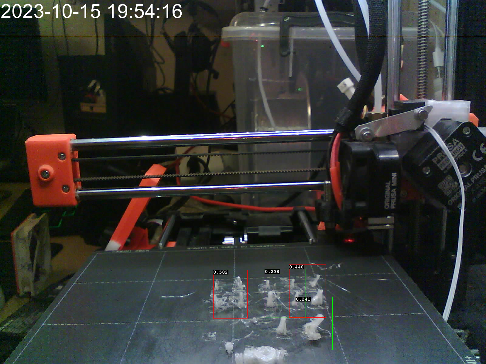

# obico-ml-api-only

Spawn [Obico ML API](https://www.obico.io/docs/server-guides/) container without any authentication.

Container image is from my modified app version - just extra debug messages and minor
tweaks, AI model is as is. You can find git sha which was used for builds in
[this repo](https://github.com/nvtkaszpir/obico-server/), the built images
are pushed to [quay.io](https://quay.io/repository/kaszpir/ml_api?tab=tags)
based on `<git-short-sha>-<arch>`.

## Usage

Just feed it with a param to fetch image to process if it is able to detect
spaghetti. Output from the API is in JSON.

```shell
docker-compose up
```

Docker compose up will spawn container which listens on port `3333`.

In general Obico ML API needs to get `img` param which tells it to fetch image from
given URL to be processed. So you need a HTTP server to host the image, which
will be consumed by python app that runs within the Obico ML API container.

The target url can be also a real working camera if it is able to return image per se -
for example [esphome web server](https://esphome.io/components/esp32_camera_web_server.html)
with `snapshot` mode will work.

### Draw detections

For pure example purposes replace `https://bagno.hlds.pl/obico/bad_1.jpg` with the url to the image from the camera.
The URL must point to the address that is resolvable and reachable by the processes within the container.

  <!-- markdownlint-disable html line-length -->

```shell
$ pip install -r requirements.txt

$ python3 draw_detections.py --api http://127.0.0.1:3333 https://bagno.hlds.pl/obico/bad_1.jpg --show

INFO:root:api=http://127.0.0.1:3333
INFO:root:show=True
INFO:root:url=https://bagno.hlds.pl/obico/bad_1.jpg
DEBUG:urllib3.connectionpool:Starting new HTTPS connection (1): bagno.hlds.pl:443
DEBUG:urllib3.connectionpool:https://bagno.hlds.pl:443 "GET /obico/bad_1.jpg HTTP/1.1" 200 999433
DEBUG:urllib3.connectionpool:Starting new HTTP connection (1): 127.0.0.1:3333
DEBUG:urllib3.connectionpool:http://127.0.0.1:3333 "GET /p/?img=https%3A%2F%2Fbagno.hlds.pl%2Fobico%2Fbad_1.jpg HTTP/1.1" 200 853
[["failure", 0.502, [758.0, 969.0, 113.0, 160.0]], ["failure", 0.44, [1012.0, 959.0, 121.0, 174.0]], ["failure", 0.241, [1034.0, 1066.0, 120.0, 176.0]], ["failure", 0.238, [939.0, 967.0, 134.0, 161.0]], ["failure", 0.174, [921.0, 1062.0, 164.0, 184.0]], ["failure", 0.163, [797.0, 1051.0, 117.0, 154.0]], ["failure", 0.1, [801.0, 1140.0, 140.0, 86.0]]]

```
  <!-- markdownlint-enable html line-length -->



Notice that TRESHOLD value by default is `0.2`
Color codes:

- blue - below TRESHOLD
- green - above TRESHOLD
- red - above 2x TRESHOLD, usually model is REALLY sure there is a spaghetti
- black -  detection in dead zone as defined in `draw_detections.py`

Notice that ml_api is processing whole image, so my example image above with
the date, can trigger false spagetti detections :)

## Example Node-RED flow

I use it with [Node-RED](https://nodered.org/) custom flow to fetch image from
cameras and send notifications. The flow is not published yet.

- obico ml_api runs in container which exposes API via given port without any auth (this repo)
- Node-RED flow fetches images from esp32-camera (but could be from any camera)
- the image is available as static content via Node-RED at specific endpoint
- Node-RED flow does http request to `ml_api` with param to fetch image which was just a moment ago fetched by Node-RED itself
- in response there is a JSON with list of detections if any
- that responses is processed by Node-RED function + specific node so if the trigger level is reached
  then new message is generated
- that generated message can be routed to anything you like, so I chose discord,
  but could be other action if needed, for example send web call to Prusa printer
  to stop the print (but watch out for false positives)


