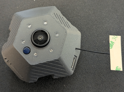

# Prusa Buddy3D Camera hacks




# Disclaimer

Whatever you do to your camera based on the text in this readme,
you do at our own risk, no warranty.
You can damage your camera in a way that it will be non-operational (brick).

Do not do it, you have been warned.

# Acknowledgements

This would not be created without a help of some people over the internet
such as reddit or discord communities.

Major input was taken from [reddit post by j4cbo](https://old.reddit.com/r/prusa3d/comments/1pmhcqj/buddy3d_camera_setup_with_no_cloud_or_internet/)

# Requirements

- USB-C power source
- microSD card with at least 32GB of size (probably smaller will work, also 256GB worked)
- a bit of tech skill in text editor
- camera hardware - this was tested on Prusa Buddy3d Camera that came with Prusa Core One L,
  more hardware details are required to added here

# Known limitations

- tested only on firmware 3.1.0, 3.1.2, 3.1.3
- sounds used are from the stock rom, they can be misleading :)
- RTSP is enabled by default on reboot, and this disables WebRTC streaming (and vice-versa),
  also see [#video-webrtc-mode](video-webrtc-mode)
- in `sync_loop.sh` by default `SYNC_WHEN_STREAMING=false` is set, which means any active streaming will prevent
  performing rsync action - in that case stop streaming via Prusa Connect / App and it should sync.
  Setting SYNC_WHEN_STREAMING=true will force kill lp_app and abort streamings to make a rclone sync.
- WebRTC streaming is not detected and thus can be killed when timelapse video was detected

# Overview

- prepare microSD card to be formatted as MBR partition table with single primary partition as FAT32
  (extFat not tested, but ext4 did not work)
- ensure wifi network is on 2.4GHz, with WPA2 xor WPA3
  (mixing WPA2 and WPA3 ends in issues),
  no special letters such as spaces or dollar sign are recommended in SSID or password
  (generally dumb vars passed unquoted to bash one after another)
- prepare directories on the microSD cards (optional)
- prepare `lp_app.sh` script on the microSD card on the root directory with the contents below (more details later)

# Firmware

You can get the info about current firmware via visiting [https://connect-ota.prusa3d.com/](https://connect-ota.prusa3d.com/)

```shell
curl https://connect-ota.prusa3d.com/ | jq '.'
  % Total    % Received % Xferd  Average Speed   Time    Time     Time  Current
                                Dload  Upload   Total   Spent    Left  Speed
100   137  100   137    0     0    831      0 --:--:-- --:--:-- --:--:--   835
{
  "file": "https://connect-ota.prusa3d.com/file/cam-3.1.2.tar",
  "last_version": "3.1.2",
  "sha1sum": "422ad4e2676e1a6c6991ffdfbb3fdc0882335617"
}

```

As you can see in the above example the last version available is `3.1.2`.
But we can fetch the newer one if we know the number :)

## Flashing new firmware to the camera

**Notice** Make sure to remove `lp_app.sh` from the sdcard before flashing.

We use firmware `cam-3.1.3.tar` but it also works with [cam-3.1.2.tar](https://connect-ota.prusa3d.com/file/cam-3.1.3.tar),
generally new firmware works better with the Wi-Fi setups.

- prepare microSD card with a MBR partition table
- create a single FAT32 partition on the microSD card
- download [cam-3.1.3.tar](https://connect-ota.prusa3d.com/file/cam-3.1.3.tar) file to the microSD card
- rename `cam-3.1.3.tar` to `cus_update_ota.tar`
- safe eject the microSD card
- turn off the camera from the USB power
- put microSD card it into the camera
- plug in cable to the camera
- you should hear the firmware update was performed (successful)
- device should restart and try to connect to the wifi (and will probably fail)
- the `cus_update_ota.tar` will be gone from the card

# Connecting to the Wi-Fi

- ensure wifi network is on 2.4GHz, with WPA2 or WPA3  but not both (mixing WPA2 and WPA3 ends in issues),
  no special letters such as spaces or dollar sign are recommended in SSID or password
  (generally there can be an issue that the wifi script treats dollars as passed in variables and thus fails,
  same with the space in the values where it may treat them as extra parameters to the script)

- go to [PrusaConnect Printers](https://connect.prusa3d.com/printers/) to your printer
- make sure the desired printer is already powered on and visible and active (online) on the Connect page
- select the desired printer, select Camera tab
- at the bottom you should see `Add Wi-Fi camera`, click it
- enter wifi ssid and password, click `Generate QR Code`, keep the generated code visible on the screen
- power on the Buddy3d camera (if it is not on), wait about 30s
- click once on the button next to the microSD port on the camera, it should say QR code scanning is in progress
- point the camera towards the generated QR code
- it should say QR code scan successful, and it should try to connect to the wifi
- if the camera connected to the wifi, very good, if not, oh well, try with wifi password that has multiples 8 letters
- wait about 30s and remove power from the camera, remove the microSD card

# Enabling telnet

- turn off the camera, remove the microSD card
- put microSD card in the computer
- copy `lp_app.sh` onto the microSD card
- generally you need to have a `lp_app.sh` on the microSD card with the content:

```shell
#!/bin/sh

# enable telnet
telnetd
# spawn basic app to enable wifi and other stuff
lp_app --noshell --log2file /mnt/sdcard/logs &
```

- safe eject the microSD,

- put microSD card back into the camera
- power on the camera, wait until it connects to the wifi
- find the camera in your router setup in DHCP config, otherwise see the PrusaConnect
  for the camera details and see th IP address, referenced later as `camera_ip_address`,
- in the system under Mac/Linux write `telnet camera_ip_address` or under Windows use Putty
  to connect to the camera

- username `root`, password `rockchip`

# Enabling RTSP

This automatically disables WebRTC streaming.

This is already a part of the scripts below and is enabled by default,
generally you need to set `rtsp_server_mode=2` via scripts, see below.

# RTSP streaming

- find the camera in your router setup in DHCP config, otherwise see the PrusaConnect
  for the camera details and see th IP address, referenced later as `camera_ip_address`,
  such as if the Connect says `Wi-Fi IPv4 address 192.168.1.75` then `camera_ip_address` is `192.168.1.75`

- use the `camera_ip_address` to connect to it via VLC:
  Open Network `rtsp://camera_ip_address/live`
  so if your then `camera_ip_address` is `192.168.1.75` then VLC network address is `rtsp://192.168.1.75/live`

- under Linux you can just try in the terminal:
  `ffplay rtsp://camera_ip_address/live` such as
  `ffplay rtsp://192.168.1.75/live`

## Disable RTSP

This is optional, because if the streaming is enabled then the script will not do any sync.
You have to disable streaming in Prusa Connect or in the scripts.

Via script - you can comment out sections related to `enable rtsp server over...` in `lp_app.sh`,
Or disable/enable it via PrusaConnet.

# Enabling rclone auto sync

## Prepare rclone and config

- install locally rclone for given architecture so you can run it in the terminal/console

- run `rclone configure --config rclone.conf` and follow setting up a new remote,
  for example [SMB](https://rclone.org/smb/) for NAS, generally you are creating a new rclone remote

- make sure the config works via `rclone --config rclone.conf ls <remote_name>:/some/path`
  (where `/some/path` is a full path to the samba share and path), this is your `RCLONE_DST`,
  in my setup it is named `bagno-smb:media/prusa/` because remote is named `bagno-smb` whis is a samba
  server with a `media` share, with `prusa/` path within the share

- download rclone binary for [ARMv7 32Bit Linux](https://downloads.rclone.org/v1.73.0/rclone-v1.73.0-Linux-arm-v7.zip),
  unpack the zip, the `rclone` file is important

- copy ARMv7 32Bit Linux `rclone` to microsd card

## microSD card preparation

- turn off the camera, remove the microSD card
- put microSD card in the computer
- copy `lp_app.sh` onto the microSD card
- **THIS IS REQUIRED** edit `sync_loop.sh` and change `RCLONE_DST` to the valid rclone remote you tested in the step above
- copy `sync_loop.sh` onto the microSD card
- copy `rclone.conf` onto the microSD card
- copy `rclone` ARMv7 binary onto the microSD card

- safe eject the microSD,

- put microSD card back into the camera
- power on the camera, wait until it connects to the wifi

- control camera over PrusaConnect - disable streaming, enable timelapse, wait 30s, stop timelapse

- if you disable streaming and enable timelapse and then stop timelapse, then after few second you should hear a sound
  (something about auto destruction..) which means rclone process started

- after successful rclone you will hear 'wifi connection...' again and the camera is back to the normal operation mode
- if not, see debug section

## Debug

See `tail -f /mnt/sdcard/debug.log` or `/mnt/sdcard/rclone.log` for more details.
you can `killall <script_pid>` for debug, or whatever.

The best option is to telnet to the camera, stop the script via (then you have 10min for debug) and run rclone commands directly
to see what is wrong.

Notice that rclone params seems to work with my setup (smb sync),
and increasing connections/transfers/memory will quickly lead to the out of memory kills.
If you have another working setup, then pease make an issue/PR, ask me on Discord.

# Blocking updates

- safest - in DNS server set `connect-ota.prusa3d.com` to `127.0.0.1`
- if you cannot control your DNS server - mount root partition on the device as `rw`,
  add entry to `/etc/hosts` for the domain and restore `ro` partition:

```shell
mount -o remount,rw /
cat >/etc/hosts<<EOF
127.0.0.1       localhost
127.0.1.1       Rockchip
127.0.0.1       connect-ota.prusa3d.com
EOF
mount -o remount,ro /
```

# Other notes

- no bash in the image, use sh for scripts (busybox ash)
- the camera is based on armv7 arch so you should be able to run binaries built
  for armv6 or armv7 on it without an issue (but not arm64 or anything else)
- single core cpu - rockchip, so not much compute power is available
- generally running app for the snapshots + streaming leaves about 6MB of free memory, not much to run anything else
- worth to see to /userdata and /tmp and /oem directories
- in 3.1.3 version ntp server is listening on the camera.... hmmm.

# video quality

/userdata/xhr_config.ini video_quality:

- 5 - SD (Standard Definition)
- 6 - HD (High Definition, default)
- 7 - FHD (Full High Definition)

# video WebRTC mode

This automatically disables RTSP server.
Allows streaming over the internet, via control servers owned by Prusa, so as of now there is no option
to control it in other way, and thus you can use only Prusa app on the mobile devices.
There is no network service exposed until client requests streaming.

# More advanced settings

- unmount and mount microsd with permissions to exec files, as in the [sync_loop.sh](./sync_loop.sh)
- microSD can be partitioned to two partitions and on the second partition you can make ext4
  and store executable files if needed
- I suggest mounting it under /tmp/sdcard2:

```shell
mkdir -p /tmp/sdcard2
mount /dev/mmcblk1p2 /tmp/sdcard2
```

- there is no support for swap file or swap partitions, at least not in 3.1.2 version, the binaries are there,
  but trying to use the commands ends in `Not Implemented` error.

- building armv7 golang binaries:

```shell
GOOS=Linux GOARCH=arm GOARM=7 go build .
```

but you usually need to remove includes to minimize the app memory usage to absolute minimum, otherwise
the app will take forever to start or can get OOMKilled by the system.

You can get severely stripped rclone to the absolute minimum ([build it on your own](https://github.com/rclone/rclone/issues/3005))
on the device but it will be barely usable while taking pictures and streaming

then you could run something like a [rclone web server](https://rclone.org/commands/rclone_serve_http/), such as

```shell
# cat /tmp/sdcard2/rclone/rclone.conf
[buddy3dcam]
type = local
```

```shell
/tmp/sdcard2/rclone/rclone --config /tmp/sdcard2/rclone/rclone.conf serve http --addr=:8080 buddy3dcam:/mnt/sdcard/
```

but better option would be detecting if the timelapse is finished, thus stopping lpp_app
and then start rclone sync/move files to remote location and turn on lpp_app back again.

Similar issues with any golang related log forwarding (promtail, otel maybe...)

## Rclone logo resize

```shell
wget https://rclone.org/img/logo_on_dark__horizontal_color.svg
convert -density 396 -resize 396x -background black logo_on_dark__horizontal_color.svg rclone.png
0
```
