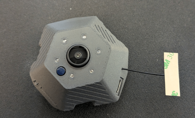

# Prusa Buddy3D Camera hacks



# Disclaimer

Whatever you do to your camera based on the text in this readme,
you do at our own risk, no warranty.
You can damage your camera in a way that it will be non-operational (brick).

Do not do it, you have been warned.

# Acknowledgements

This would not be created without a help of some people over the internet
such as reddit or discord communities.

Major input was taken from [reddit post by j4cbo](https://old.reddit.com/r/prusa3d/comments/1pmhcqj/buddy3d_camera_setup_with_no_cloud_or_internet/)

# Requirements

- USB-C power source
- microSD card with at least 32GB of size (probably smaller will work, also 256GB worked)
- a bit of tech skill in text editor
- camera hardware - this was tested on Prusa Buddy3d Camera that came with Prusa Core One L,
  more hardware details are required to added here
- firmware 3.1.0 (also worked on 3.1.2 on my setup)

# Overview

- prepare microSD card to be formatted as MBR partition table with single primary partition as FAT32
  (extFat not tested, but ext4 did not work)
- ensure wifi network is on 2.4GHz, with WPA2 xor WPA3
  (mixing WPA2 and WPA3 ends in issues),
  no special letters such as spaces or dollar sign are recommended in SSID or password
  (generally dumb vars passed unquoted to bash one after another)
- prepare directories on the microSD cards (optional)
- prepare `lp_app.sh` script on the microSD card on the root directory with the contents below (more details later)

# Firmware

## Flashing new firmware to the camera

We use firmware `cam-3.1.0.tar` but it also works with [cam-3.1.2.tar](https://connect-ota.prusa3d.com/file/cam-3.1.2.tar),
generally new firmware works better with the Wi-Fi setups.

- prepare microSD card with a MBR partition table
- create a signle FAT32 partition on the microSD card
- download [cam-3.1.0.tar](https://connect-ota.prusa3d.com/file/cam-3.1.0.tar) file to the microSD card
- rename `cam-3.1.0.tar` to `cus_update_ota.tar`
- safe eject the microSD card
- turn off the camera from the USB power
- put microSD card it into the camera
- plug in cable to the camera
- you should hear the firmware update was performed (succesful)
- device should restart and try to connect to the wifi (and will probably fail)
- the `cus_update_ota.tar` will be gone from the card

# Connecting to the Wi-Fi

- ensure wifi network is on 2.4GHz, with WPA2 or WPA3  but not both (mixing WPA2 and WPA3 ends in issues),
  no special letters such as spaces or dollar sign are recommended in SSID or password
  (generally there can be an issue that the wifi script treats dollars as passed in variables and thus fails,
  same with the space in the values where it may treat them as extra parameters to the script)
- go to [PrusaConnect Printers](https://connect.prusa3d.com/printers/) to your printer
- make sure the desired printer is already powered on and visible and active (online) on the Connect page
- select the desired printer, select Camera tab
- at the bottom you should see `Add Wi-Fi camera`, click it
- enter wifi ssid and password, click `Generate QR Code`, keep the generated code visible on the screen
- power on the Buddy3d camera (if it is not on), wait about 30s
- click once on the button next to the microSD port on the camera, it should say QR code scanning is in progress
- point the camera towards the generated QR code
- it should say QR code scan successful, and it should try to connect to the wifi
- if the camera connected to the wifi, very good, if not, oh well, try with wifi password that has multiples 8 letters
- wait about 30s and remove power from the camera, remove the microSD card

# Enabling RTSP

- turn off the camera, remove the microSD card
- put microSD card in the computer
- create a file named `lp_app.sh` on it, or copy it from the current repo,
  below absolute minimum version to have it up and running with RTSP enabled
- saafe eject the microSD,
- put microSD card back into the camera
- power on the camera, wait until it connects to the wifi
- find the camera in your router setup in DHCP config, otherwise see the PrusaConnect
  for the camera details and see th IP address, referenced later as `camera_ip_address`,
  such as if the Connect says `Wi-Fi IPv4 address 192.168.1.75` then `camera_ip_address` is `192.168.1.75`

- use the `camera_ip_address` to connect to it via VLC:
  Open Network `rtsp://<camera_ip_address>/live`
  so if your then `camera_ip_address` is `192.168.1.75` then VLC network address is `rtsp://192.168.1.75/live`

- under linux you can just try in the terminal:
  `ffplay rtsp://<camera_ip_address>/live` such as
  `ffplay rtsp://192.168.1.75/live`

# Enabling telnet

- perform steps in the section above
- in the system under mac/linux write `telnet <camera_ip_address>` or under windows use Putty
  to connect to the camera
- username `root`, password `rockchip`

# Blocking updates

- safest - in DNS server set `connect-ota.prusa3d.com` to `127.0.0.1`
- if you cannot control your DNS server - mount root partition on the device as `rw`,
  add entry to `/etc/hosts` for the domain and restore `ro` partition:

```shell
mount -o remount,rw /
cat >/etc/hosts<<EOF
127.0.0.1       localhost
127.0.1.1       Rockchip
127.0.0.1       connect-ota.prusa3d.com
EOF
mount -o remount,ro /
```

# Other notes

- the camera is based on armv7 arch so you should be able to run binaries built
  for armv6 or armv7 on it without an issue (but not arm64 or anything else)
- single core rockchip, so not much compute power is available
- generally running app for the snapshots + streaming leaves about 6MB of free memory, not much to run anything else
- worth to see to /userdata and /tmp and /oem directories

# More advanced settings

- microSD can be partitioned to two partitions and on the second partition you can make ext4
  and store executable files if needed
- I suggest mounting it under /tmp/sdcard2:

```shell
mkdir -p /tmp/sdcard2
mount /dev/mmcblk1p2 /tmp/sdcard2
```

- there is no support for swap file or swap partitions, at least not in 3.1.2 version, the binaries are there,
  but trying to use the commands ends in `Not Implemented` error.

- building armv7 golang binaries:

```shell
GOOS=linux GOARCH=arm GOARM=7 go build .
```

but you usually need to remove includes to minimize the app memory usage to absolute minimum, otherwise
the app will take forever to start or can get OOMKilled by the system.

You can get severely stripped rclone to the absolute minimum ([build it on your own](https://github.com/rclone/rclone/issues/3005))
on the device but it will be barely usable while taking pictures and streaming

then you could run something like a [rclone web server](https://rclone.org/commands/rclone_serve_http/), such as

```shell
# cat /tmp/sdcard2/rclone/rclone.conf
[buddy3dcam]
type = local
```

```shell
/tmp/sdcard2/rclone/rclone --config /tmp/sdcard2/rclone/rclone.conf serve http --addr=:8080 buddy3dcam:/mnt/sdcard/
```

but better option would be detecting if the timelapse is finished, thus stopping lpp_app
and then start rclone sync/move files to remote location and turn on lpp_app back again.

Similar issues with any golang related log forwarding (promtail, otel maybe...)
