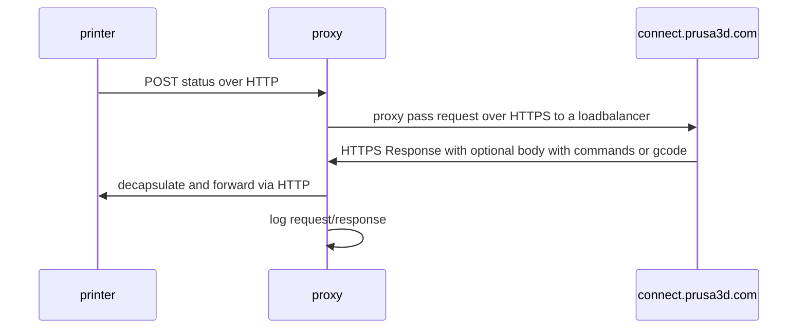

# prusa-connect-proxy

Create HTTP forward proxy for Prusa Connect for LAN.
This should help in certain situations such as corporate or air-gapped networks.

By default two ports are listening:

- `8889` for `buddy-a.connect.prusa3d.com`
- `8890` for `connect.prusa3d.com`

Why? See below in [known limitations](#known-limitations).

Connection diagram:



# Known Limitations

- you can not have debug and normal proxies up and running on the same port with
  docker-compose (well it is possible, but requires much more tweaking...)

- certain printers have some compute limits and thus they do not connect to
  `connect.prusa3d.com` but to `buddy-a.connect.prusa3d.com` which uses different
  cert without Certificate Authority chain. If you try to upload file via
  Prusa Connect to the printer and it fails, then change address to `buddy-a...`
  in `nginx/conf.d/default.conf` (it is default now)

- if you have mixed setup of different printers you may want to host two proxy
  instances on different ports, which redirect to different upstreams.
  Current setup supports is, just select different port for different pool of
  the printers.

# Todo

- maybe [json log](https://github.com/openresty/docker-openresty/blob/master/nginx.conf)?

# Requirements

- firmware on the printer supports Prusa Connect - so you probably need
  firmware newer than 2023.10.1 for given printer (excluding alpha versions)
- docker-compose to run containers
- printer and docker-compose host should be in the same network to make life easier

# Usage

## Difference between versions

- `prusa-connect-proxy-debug` - dumps traffic to log files under `logs/` dir,
  which will turn HUGE, use it for just to see around what runs in the network
  for few hours
- `prusa-connect-proxy-stdout` - run in normal mode with basic logs to stdout
  and stderr, **this is preferred way** to run it in day to day operation

## Quick how to

1. spawn docker container with nginx listening on 8889
2. configure printer to use that nginx instance
3. ...
4. profit

## Long howto

### Spawn docker container with nginx

Spawn docker container with nginx listening on `8889`:

```shell
docker-compose up
```

write down IP address under which container is reachable
over LAN network, let say it is `my-proxy-ip`.

### Configure printer to use that nginx instance

1. Create filename `prusa_printer_settings.ini` for specific printer -
    you can actually use existing config from Prusa Connect and download it
    and then adjust it,

    make sure to define `[service::connect]` section as below,
    just make sure to replace `my-proxy-ip` with the address of the host
    that runs docker with nginx, port to `8889` or `8890` depending on the
    printer's capabilities and `myRandomToken` with some token
    (no idea how to generate yet):

    ```ini
    [service::connect]
    hostname = my-proxy-ip
    tls = false
    port = 8889
    token = myRandomToken
    ```

    so if your host that runs docker is `192.168.0.20` and token is `deadbeef`
    then config is

    ```ini
    [service::connect]
    hostname = 192.168.0.20
    tls = false
    port = 8889
    token = deadbeef
    ```

2. turn off the printer
3. remove pendrive from the printer
4. connect pendrive to the printer
5. save `prusa_printer_settings.ini` to the pendrive
6. safe remove pendrive
7. connect pendrive to the printer
8. turn on the printer, wait until it boots
9. go to Settings > Networking > Prusa Connect > Load Settings from pendrive

You should see in the logs of the nginx container that it starts to proxy
requests between the printer and the Prusa Connect:

```log
nginx  | 192.168.1.25 - - [16/Jan/2024:21:49:17 +0000] "POST /p/telemetry HTTP/1.1" 204 0 "-" "-" "-"
nginx  | 192.168.1.25 - - [16/Jan/2024:21:49:21 +0000] "POST /p/telemetry HTTP/1.1" 204 0 "-" "-" "-"
nginx  | 192.168.1.25 - - [16/Jan/2024:21:49:25 +0000] "POST /p/telemetry HTTP/1.1" 204 0 "-" "-" "-"
nginx  | 192.168.1.25 - - [16/Jan/2024:21:49:29 +0000] "POST /p/telemetry HTTP/1.1" 204 0 "-" "-" "-"
nginx  | 192.168.1.25 - - [16/Jan/2024:21:49:33 +0000] "POST /p/telemetry HTTP/1.1" 204 0 "-" "-" "-"
```

## Run nginx in the background

```shell
docker-compose stop
docker-compose up -d
```

## Switching between debug or stdout setup

Ensure to stop old container in other directory prior starting a new one.
Actually docker probably will scream that ports are already used, anyway.

# Other notes

If it works then you may want to tweak configs to disable proxy cache or logs,
but then I assume you already know what to do with the configs :)
