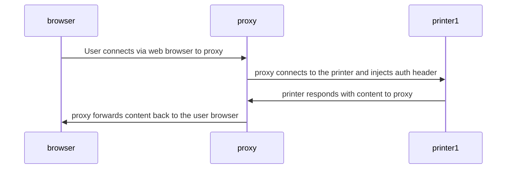

# prusa-link-no-password

Create HTTP forward proxy for Prusa Link for LAN printers.
Allows to access your printer without passwords (well, almost).

Connection diagram:



# Warning

This code is without any warranty, use at your own risk.
This effectively strips any security when accessing printer,
so if someone has access to the host that runs this code,
then they can do whatever they want with the printer,
such as print files / abort existing print, delete files... etc

# Known Limitations

- Tested only with Prusa Mini+ v5.1.2, for other printers/configs
  it probably requires additional headers or changed headers.
- if caching enabled then some things are aggressively cached for 7 days.

# Requirements

- docker
- printer and proxy host should be in the same network to make life easier

# Usage

## Using without docker

You should be able to just copy/paste files from `nginx/conf.d/` to the normal,
standalone nginx to `/etc/nginx/conf.d/`, reload service and you're done.
Anyway, just read below readme for more details, you're gonna need it anyway.

## Using with docker

## Configuring first printer

Edit `nginx/conf.d/printer1.conf` and adjust:

- `10001` - change listening port of the nginx proxy, 10001 to your desired port
- `192.168.1.25` - this is an address of your printer with PrusaLink
- `X-Api-Key` value - this contains key to authorize when you access printer over PrusaLink.

Then edit `docker-compose.yaml` and ensure that ports section targets the port you defined above:

```yaml
    ports:
      - "10001:10001/tcp" # printer1.conf
```

Run `docker-compose start`.

Point your browser to [http://127.0.0.1:10001](http://127.0.0.1:10001)

If you run docker on different host then remember to allow `10001` on the firewall
and just use address of the host, so lets say your NAS is on 192.168.1.20 and
it runs that container then try [http://192.168.1.20:10001](http://192.168.1.20:10001)

## Adding next printer

In general ports should be unique otherwise there will be error when starting
a container (AFAIR).

- copy `nginx/conf.d/printer1.conf` as new file, for example `nginx/conf.d/printer2.conf`
- edit `nginx/conf.d/printer2.conf` - bump port number (let say `10002`), address, X-Api-Key
- edit docker-compose.yaml and add additional port
- restart container `docker-compose restart`
- point your browser to [http://127.0.0.1:10002](http://127.0.0.1:10002)

# Other

## Run in the background

Run in the background:

```shell
docker-compose stop
docker-compose start -d
```

## Single port and multi printer

It's possible to have one listening port and redirection to different printers
based on the path, but the config gets more complex. Usually if you need it then
ask me on Prusa Discord server.

# Caching

Tested on Prusa Mini+ v6.2.2 only

To avoid issues with too may requests hitting the printer's API I've added caching,
where thumbnails are for 24h and anything else is for 1s.

Example access log with cache details:

<!-- markdownlint-disable html line-length -->
```text
nginx_proxy  | cache_thumb 172.24.0.1 - HIT [29/Mar/2025:13:59:27 +0000]  "GET /thumb/l/usb/SHAPE-~1.BGC HTTP/1.1" 200 18631 "http://127.0.0.1:10001/" "Mozilla/5.0 (X11; Linux x86_64) AppleWebKit/537.36 (KHTML, like Gecko) Chrome/133.0.0.0 Safari/537.36"
nginx_proxy  | cache_default 172.24.0.1 - STALE [29/Mar/2025:13:59:27 +0000]  "GET /api/v1/files/usb/ HTTP/1.1" 304 0 "http://127.0.0.1:10001/" "Mozilla/5.0 (X11; Linux x86_64) AppleWebKit/537.36 (KHTML, like Gecko) Chrome/133.0.0.0 Safari/537.36"
nginx_proxy  | cache_thumb 172.24.0.1 - HIT [29/Mar/2025:13:59:27 +0000]  "GET /thumb/l/usb/SHAPE-~3.GCO HTTP/1.1" 200 30766 "http://127.0.0.1:10001/" "Mozilla/5.0 (X11; Linux x86_64) AppleWebKit/537.36 (KHTML, like Gecko) Chrome/133.0.0.0 Safari/537.36"
nginx_proxy  | cache_thumb 172.24.0.1 - HIT [29/Mar/2025:13:59:27 +0000]  "GET /thumb/l/usb/SHAPE-~2.BGC HTTP/1.1" 200 18631 "http://127.0.0.1:10001/" "Mozilla/5.0 (X11; Linux x86_64) AppleWebKit/537.36 (KHTML, like Gecko) Chrome/133.0.0.0 Safari/537.36"
nginx_proxy  | cache_default 172.24.0.1 - HIT [29/Mar/2025:13:59:28 +0000]  "GET /api/v1/files/usb/ HTTP/1.1" 304 0 "http://127.0.0.1:10001/" "Mozilla/5.0 (X11; Linux x86_64) AppleWebKit/537.36 (KHTML, like Gecko) Chrome/133.0.0.0 Safari/537.36"
nginx_proxy  | cache_default 172.24.0.1 - STALE [29/Mar/2025:13:59:28 +0000]  "GET /api/v1/status HTTP/1.1" 200 265 "http://127.0.0.1:10001/" "Mozilla/5.0 (X11; Linux x86_64) AppleWebKit/537.36 (KHTML, like Gecko) Chrome/133.0.0.0 Safari/537.36"
nginx_proxy  | cache_default 172.24.0.1 - HIT [29/Mar/2025:13:59:28 +0000]  "GET /api/v1/storage HTTP/1.1" 200 107 "http://127.0.0.1:10001/" "Mozilla/5.0 (X11; Linux x86_64) AppleWebKit/537.36 (KHTML, like Gecko) Chrome/133.0.0.0 Safari/537.36"
nginx_proxy  | cache_thumb 172.24.0.1 - HIT [29/Mar/2025:13:59:28 +0000]  "GET /thumb/l/usb/SHAPE-~2.GCO HTTP/1.1" 200 9820 "http://127.0.0.1:10001/" "Mozilla/5.0 (X11; Linux x86_64) AppleWebKit/537.36 (KHTML, like Gecko) Chrome/133.0.0.0 Safari/537.36"
nginx_proxy  | cache_thumb 172.24.0.1 - HIT [29/Mar/2025:14:13:56 +0000]  "GET /thumb/l/usb/VSLOT2~7.GCO HTTP/1.1" 200 28924 "-" "curl/7.81.0"
nginx_proxy  | cache_thumb 172.24.0.1 - HIT [29/Mar/2025:14:13:58 +0000]  "GET /thumb/l/usb/VSLOT2~7.GCO HTTP/1.1" 200 28924 "-" "curl/7.81.0"
nginx_proxy  | cache_thumb 172.24.0.1 - HIT [29/Mar/2025:14:14:00 +0000]  "HEAD /thumb/l/usb/VSLOT2~7.GCO HTTP/1.1" 200 0 "-" "curl/7.81.0"
```
  <!-- markdownlint-enable html line-length -->

If youwant to disable logs then remove or comment out lines with `access_log` from the config.
